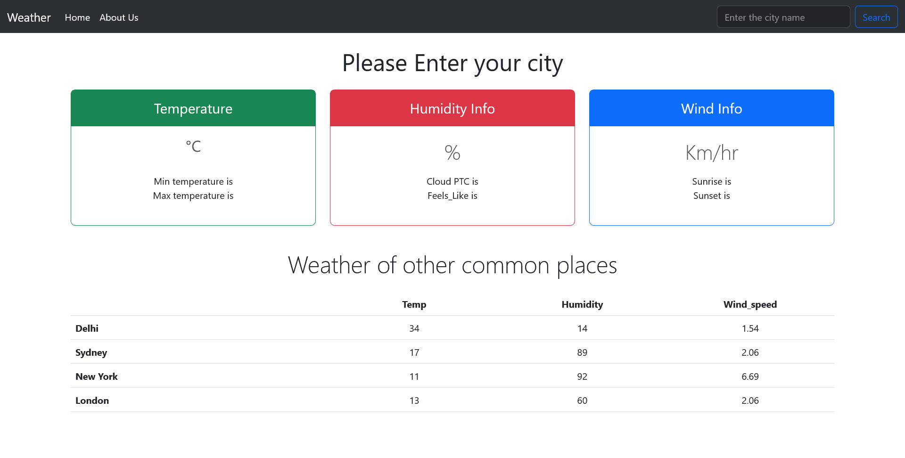
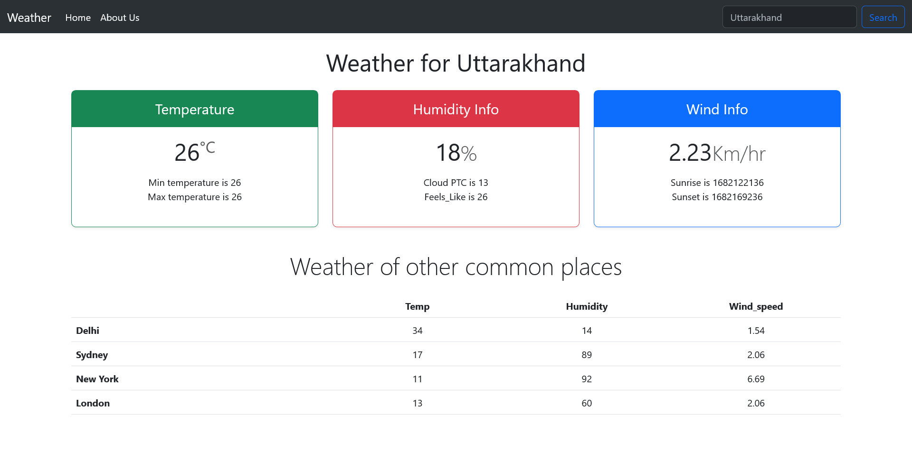

# Weather App

This is a code practice for improving my coding skills by building realistic projects.

## Table of contents

- [Overview](#overview)
  - [The challenge](#the-challenge)
  - [Screenshot](#screenshot)
  - [Links](#links)
- [My process](#my-process)
  - [Built with](#built-with)
  - [What I learned](#what-i-learned)
- [Author](#author)
- [Acknowledgments](#acknowledgments)

## Overview

### The challenge

Users should be able to:

- See the temperature and other details by entering the city name.

### Screenshot

### Links

- Solution URL: [Github URL]()
- Live Site URL: [Live site]()

## My process

### Built with

- Semantic HTML5 markup
- Bootstrap Front-end framework
- JavaScript

### What I learned

I learned alot from this project.
I learned how to use bootstrap for designing.
I learned how to fetch the details using Rapid API for displaying the weather details.

## Author

- Frontend Mentor (Here is my frontend mentor profile) - [@Nitesh-bit](https://www.frontendmentor.io/profile/Nitesh-bit)

## Acknowledgments

I would like to thanks StackOverflow as they helped me to solve mostly all my errors I encountered making this project amd Bootstrap for the designing part.
